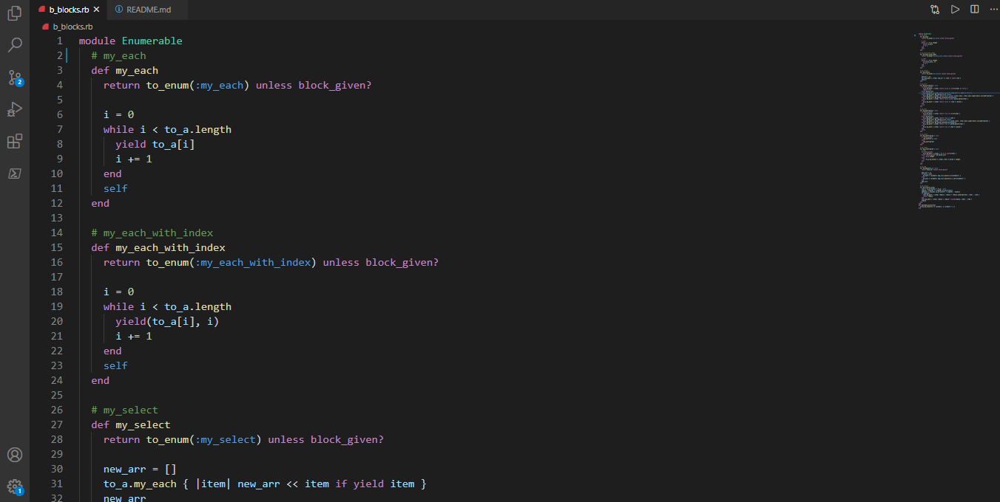

# Enumerable-methods-ruby

 This is Advanced Building Blocks project putting emphasis on the use of enumerable methods.

Additional description about the project and its features.

## Built With

- Ruby-enumerable methods

## Live Demo

[Live Demo Link](https://el28dev.github.io/Enumerable-methods-ruby/)

## Authors

- GitHub: [@Elyor](https://github.com/EL28DEV)
- LinkedIn: [Elyor](https://www.linkedin.com/feed/)
- Twitter: [@elyor-doniyorov](https://twitter.com/home?lang=ru)

## Authors

- GitHub: [@uwadonat](https://github.com/uwadonat)
- LinkedIn: [Donat](www.linkedIn.com/in/uwamahoro-donat-84b5bb1b7/)
- Twitter: [@uwamahoroDonat](https://twitter.com/uwamahoroDonat)

## Getting Started

To get a local copy of the repository please run the following commands on your terminal:

$ cd <folder>
$ git clone https://github.com/EL28DEV/Enumerable-methods-ruby.git

Testing
To test the code, run rspec from root of the folder using terminal.

    Rspec is used for the test.

$ gem install rspec

## Show your support

Give a ⭐️ if you like this project!!

## 📝 License

This project is [MIT](LICENSE) licensed.
